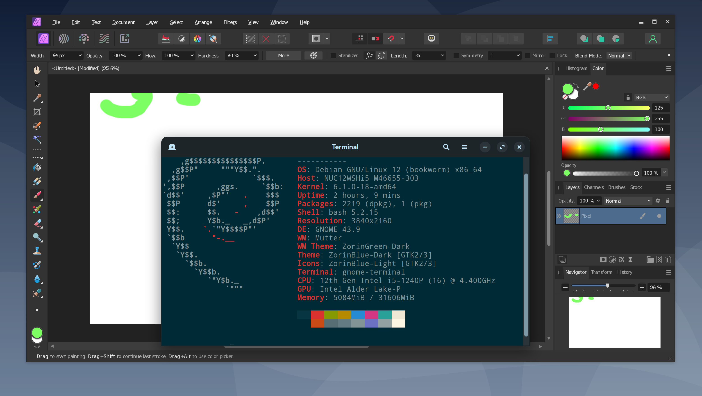

# AffinityPhoto2Linux
Affinity Photo/Designer installer for Linux (Tested on Debian12)

Thanks for the great work of James McDonnell and @daniel080400.

# Reference
[Affinity Suite v2.0.4 on linux [ Wine ]](https://forum.affinity.serif.com/index.php?/topic/182758-affinity-suite-v204-on-linux-wine/)

[daniel080400/AffinityLinuxTut](https://github.com/daniel080400/AffinityLinuxTut/tree/main)

# Note
This repo will install wine and Affinity apps all in repo folder, so it won't affect your own wine in your system.

The wine build will be in <b>./ElementalWarrior-wine/wine-install</b>

The Affinity apps will be installed in <b>./affinity</b>

# Build Wine

<b>Run 1.build_wine.sh</b>

Wine Repo: [James McDonnell/ElementalWarrior](https://gitlab.winehq.org/ElementalWarrior/wine)

Branch: affinity-photo2-wine8.14

 💡 In case the branch is merged/deleted, here is a copy in this repo: ElementalWarrior-wine.tar.xz

 # Install Affinity Photo/Designer

 Download your own msi(exe) file from Serif and place it in the folder, this repo is using affinity-photo-msi-2.4.0.exe.
 
 Please note that <b>msix</b> may not working!

<b>Run 2.install_affinity.sh</b>

You may able to start with launcher.sh now!

# Desktop icon

Since wine and Affiniy apps are placed in repo folder, please edit your own path in Affinity Photo.desktop.

